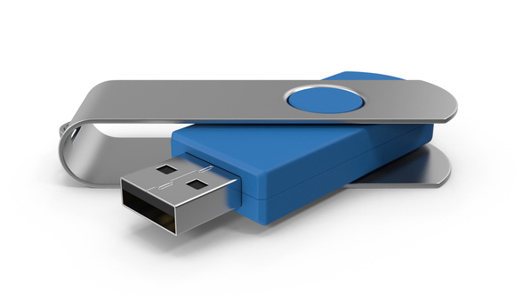

# USB Tricks



:::tip
The brain only checks for the presence of USB sticks at boot, only plug and unplug USB sticks when the brain is off (front panel blue light off).
:::

:::warning
During the competition we need to have unrestricted access to at least one USB port, if you want to use a USB stick during the competition it must leave enough space around at least one port to insert our low profile arena stick.
:::

## Running your code from a USB :

When started, using the start button the robot will default to running the last piece of code written in the editor. In some cases at the competition it can be useful to be able to run code from a USB stick.

1. Place a file called `main.py` or `code.zip` (which must include a file called `main.py`) in the root directory of the USB stick on another computer.
2. Turn on the robot using the red power button.
3. The file will be automatically copied from the USB stick
4. Press the black start button

:::warning

* During the competition **RoboCon** requires unrestricted access to at least one USB port, if you want to use a USB stick during the competition it must leave enough space around at least one port to insert our low profile USB stick.
* Code copied from USB sticks is not [Linted](https://en.wikipedia.org/wiki/Lint_%28software%29), sufficiently broken code may crash not just the user code, but also the web interface preventing the robot from reaching "Blinky". See [troubleshooting](/troubleshooting.html#troubleshooting) for details about what the LEDs mean. It is highly recommended for users to export working code from the editor to the USB stick rather than editing code directly. See [troubleshooting](/troubleshooting.html#the-brainbox-appears-to-power-up-but-i-can-t-connect-to-the-website-and-the-blue-led-lights-but-never-starts-flashing) for how to recover a robot which does not boot to Blinky.

:::


# Getting Logs

When running your robot code you can see the logs from the robot in the editor. Sometimes it's useful to be able to view the logs later to analyse what happened.

:::warning
* Be careful when reusing USB sticks to avoid accidentally running code from the USB Stick!
:::

1. Insert a USB stick in the robot before turning it on.
2. The log file will be automatically written to the USB stick as `logs.txt`
3. Remember to fully power down the robot before removing the USB stick


:::tip
* Logs are collected whatever way the code is run, but only the most recent logs are preserved
* The log files are also collected during system shutdown leading to worrying messages like:
:::

```
Exception in thread Thread-2:
Traceback (most recent call last):
  File "/usr/lib/python2.7/threading.py", line 801, in __bootstrap_inner
     self.run()
  File "/usr/lib/python2.7/threading.py", line 754, in run
     self.\_\_target(\*self.\_\_args, \**self.__kwargs)
  File "/root/.local/share/virtualenvs/shepherd2-rSdGMoSR/local/lib/python2.7/site
     self.run()
  File "/usr/lib/python2.7/threading.py", line 754, in run
     self.\_\_target(\*self.\_\_args, \**self.__kwargs)
 -packages/robot/wrapper.py", line 251, in wait_start_blink
     self._internal.set_status_led(v)
  File "/root/.local/share/virtualenvs/shepherd2-rSdGMoSR/local/lib/python2.7/site-packages/robot/greengiant.py", line 87, in set_status_led
     self._bus.write_byte_data(_GG_I2C_ADDR, _GG_STATUS, int(on))
  File "/root/.local/share/virtualenvs/shepherd2-rSdGMoSR/local/lib/python2.7/site-packages/smbus2/smbus2.py", line 377, in write_byte_data
     ioctl(self.fd, I2C_SMBUS, msg)
IOError: \[Errno 121] Remote I/O error
```

 These can safely be ignored unless you also see them on the web interface.

# Collecting iamges and raw analysis

Every time the robot takes a picture it is updated on the web interface, during development it is occasionally useful to be able to also keep a log of pictures that have been analysed to check camera focus, motion blur etc.

1. Add a file with the name "collect_images.txt" to the USB stick to collect the images
2. Add a file with the name "log_markers.txt" to the USB stick to collect analysis of images
3. Insert the stick before turning the robot on
4. Remember to fully shut down the robot before removing the USB stick
WARNING: Collecting all images may slow down the processing time from your robot - Use with care!

# Updating your team image

When the robot boots, it loads a default image which is displayed until the robot takes a picture, in the arena these images are displayed on an overhead projector. You can change the default image.
1. Save your Image as 440x330 pixels in jpeg format onto the USB stick as "team_logo.jpg"
2. Boot the robot once to install the image
3. Fully shut down the robot
4. The image will be used from the next time the robot is booted

:::tip
We may ask that your image includes either a Team Name or your institution (e.g. Systemetric or Hills Road Sixth Form College) to assist the Marshalls, but if you have a iconic robot design then we may waive this rule
:::
